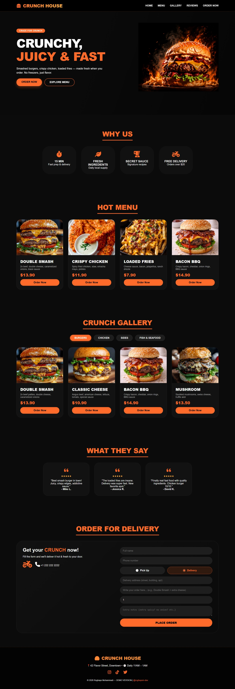

# 🍔 Fast Food Landing Page

A modern, responsive, and visually appealing Fast Food Landing Page built using HTML, CSS, and JavaScript. This project showcases a professional restaurant landing page with smooth navigation, attractive sections, and a mobile-friendly design.

---

## 🌟 Live Demo

👉 View Live Demo: https://roghayem.github.io/fastfood-landing-page/

---

## 🖼️ Preview



---

## ✨ Features

🍔 Modern and attractive fast-food landing page

📱 Fully responsive design for desktop, tablet, and mobile devices

⚡ Smooth user experience with JavaScript interactions

🎨 Clean and modern UI with custom styling

🧭 Easy navigation between sections

🖼️ High-quality food showcase section

📞 Contact and social media sections

---

## 🛠️ Technologies Used

* HTML5
* CSS3
* JavaScript (ES6)
* Flexbox
* CSS Grid
* Media Queries

---

## 🚀 How to Run Locally

1. Clone the repository:

```bash
git clone https://github.com/roghayem/fastfood-landing-page.git
```

2. Open the project folder:

```bash
cd fastfood-landing-page
```

3. Open `index.html` in your browser.

---

## 📂 Project Structure

```text
fastfood-landing-page/
│
├── index.html
├── style.css
├── script.js
├── assets/
│   └── Screenshot_1-6-2026_21349_127.0.0.1.jpeg
└── README.md
```

---

## 🎯 Project Goals

This project was created to practice and improve:

* Responsive Web Design
* Modern UI Development
* CSS Layout Techniques
* JavaScript Interactivity
* Front-End Development Best Practices

---

## 📧 Contact

Feel free to explore my GitHub profile and check out more of my projects.

GitHub: https://github.com/roghayem

---

## ⭐ Support

If you like this project, consider giving it a star on GitHub.
